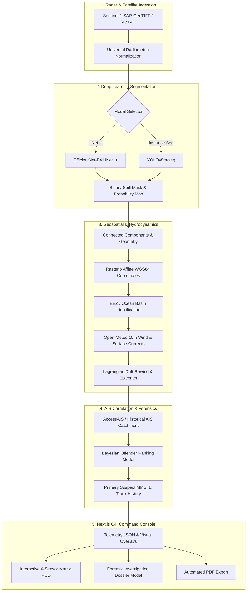

# 🛰️ AquaGuard — Autonomous Maritime Sentinel & C4I Oil Spill Platform

<div align="center">

[](https://nextjs.org/)
[](https://pytorch.org/)
[](https://github.com/ultralytics/ultralytics)
[](https://tailwindcss.com/)
[](https://www.typescriptlang.org/)
[](LICENSE)
[](https://git-lfs.github.com/)

**Next-Generation Autonomous Sentinel-1 Synthetic Aperture Radar (SAR) Oil Spill Detection, Hydrodynamic Lagrangian Drift Rewind, Real AIS Vessel Offender Identification, and C4I Evidentiary Dossier Platform.**

[Key Features](#-key-features) • [System Architecture](#-system-architecture) • [10-Phase Pipeline](#-10-phase-forensic-pipeline) • [Quickstart Guide](#-quickstart--installation) • [API Reference](#-api-reference)

</div>

---

## 🌊 Overview

**AquaGuard Maritime Sentinel** is a production-grade, state-of-the-art Command, Control, Communications, Computers, and Intelligence (**C4I**) platform engineered for maritime environmental enforcement authorities, coast guards, and environmental protection agencies.

By fusing **Sentinel-1 SAR polarimetric imagery (VV + VH bands)**, **dual deep-learning segmentation models (EfficientNet-B4 / UNet++ & YOLOv8m-seg)**, **real-time AIS vessel telemetry**, **open oceanographic vector wind fields**, and **Bayesian offender ranking**, AquaGuard transforms raw radar captures into admissible legal evidentiary dossiers within seconds.

---

## ⚡ Key Features

- **🛰️ Multi-Band SAR Sensor Ingestion**: Real-time radiometric calibration, speckle filtering, and VV/VH dual-polarization decomposition of Sentinel-1 GeoTIFF and high-resolution SAR rasters.
- **🧠 Dual-Engine AI Inference Switcher**:
  - **EfficientNet-B4 + UNet++ (Transfer Learning)**: Sub-pixel precision mask segmentation optimized for faint sheen and high false-positive rejection.
  - **YOLOv8m-seg (Real-Time Instance Segmentation)**: Ultra-fast polygon bounding, confidence heatmapping, and real-time slick isolation.
- **🌐 Affine Geospatial Coordinate Projection**: Translates sub-pixel detections into high-precision WGS84 coordinates ($\pm 0.0001^\circ$ precision) using `rasterio` spatial transforms.
- **🛡️ EEZ Maritime Sector Zoning**: Automated boundary cross-referencing against Indian EEZ, Arabian Sea, Bay of Bengal, and international shipping corridors.
- **🚢 Real-Time AIS Offender Trajectory Matching**: Integrates historical vessel traffic and NOAA AccessAIS telemetry (MMSI, vessel class, speed, heading, draught) within dynamic 10–25 km catchment radii.
- **🌪️ Lagrangian Hydrodynamic Drift Rewind**: Computes 6h–24h reverse ocean drift trajectories by fetching historical 10m vector wind fields ($u_{10}, v_{10}$) via Open-Meteo Marine APIs to locate the exact discharge epicenter.
- **⚖️ Bayesian Offender Scoring**: Multi-factor probabilistic ranking algorithm weighing vessel proximity, speed anomalies (e.g., slow passage or idling), vessel displacement, and cargo classification (Crude Oil / Chemical Tankers).
- **📄 Automated Evidentiary Dossier Generation**: Exports courtroom-ready PDF forensic dossiers with cryptographic hashes, satellite metadata, AIS tracks, weather telemetry, and legal certifications.
- **🖥️ Tactical C4I Command Radar UI**: Cyberpunk-aesthetic, high-contrast dark radar console featuring live telemetry HUDs, 6-sensor multi-spectral matrix, real-time preset switching, and interactive modal dossiers.

---

## 🏗️ System Architecture



---

## 🔬 10-Phase Forensic Pipeline

The core Python forensic backend (`scripts/maritime_sentinel_pipeline.py`) executes an end-to-end 10-phase analysis:

| Phase | Module | Functionality |
|---|---|---|
| **Phase 1** | `SAR GeoTIFF Reader` | Parses multi-band raster data, extracts bounding bounds and Affine transformation matrices. |
| **Phase 2** | `Radiometric Normalizer` | Normalizes SAR backscatter ($\sigma^0$), handles speckle noise, and standardizes tensor inputs. |
| **Phase 3** | `AI Neural Segmentation` | Infers pixel-level oil slick masks using UNet++ or YOLOv8m-seg weights. |
| **Phase 4** | `Geographic Transformer` | Maps pixel $(x, y)$ centroids, vertices, and bounding boxes into real-world WGS84 coordinates. |
| **Phase 5** | `Maritime Zoning Engine` | Identifies whether the incident falls inside the Indian Exclusive Economic Zone (EEZ) or international waters. |
| **Phase 6** | `AIS Database Query` | Queries historical AIS telemetry around the spill location during the satellite pass window. |
| **Phase 7** | `Bayesian Vessel Ranker` | Ranks suspected vessels by proximity, kinematic speed deviation, and tanker flag index. |
| **Phase 8** | `Lagrangian Drift Rewind` | Simulates backward time-drift using vector wind/current fields to locate the discharge origin. |
| **Phase 9** | `Dossier & Artifact Builder` | Generates high-res visual overlays, heatmaps, segmentation crops, and JSON telemetry. |
| **Phase 10** | `Courtroom PDF Generator` | Compiles official legal evidentiary dossiers via ReportLab with SHA-256 integrity verification. |

---

## 💻 Tech Stack

### Frontend & UI
- **Framework**: Next.js 14 (App Router)
- **Language**: TypeScript 5.6
- **Styling**: Tailwind CSS 3.4 + Custom Glassmorphism Theme
- **Animations**: Framer Motion
- **Icons**: Lucide React
- **Image Processing**: Sharp

### Backend & AI
- **Framework**: FastAPI / Next.js API Routes / Python 3.10–3.13
- **Deep Learning**: PyTorch, Segmentation Models PyTorch (SMP), Ultralytics YOLOv8
- **Geospatial Processing**: Rasterio, GeoTIFF, SciPy, NumPy
- **Oceanographic Data**: Open-Meteo Marine API, MarineCadastre AccessAIS
- **Document Generation**: ReportLab PDF Engine

---

## 🚀 Quickstart & Installation

### 1. Prerequisites
- **Node.js**: v18.17.0+ or v20.x
- **Python**: v3.10, 3.11, 3.12, or 3.13
- **Git & Git LFS**: Ensure `git-lfs` is installed ([git-lfs.com](https://git-lfs.github.com/))

### 2. Clone the Repository
```bash
git clone https://github.com/kshitijpalekar808-coder/AquaGuard-Maritime-Sentinel.git
cd AquaGuard-Maritime-Sentinel
git lfs pull
```

### 3. Install Node.js Dependencies
```bash
npm install
```

### 4. Install Python Dependencies
```bash
pip install -r requirements.txt
```

### 5. Launch the Development Environment
```bash
npm run dev
```

Open [http://localhost:3000](http://localhost:3000) in your browser to access the live C4I Command Console.

---

## 📡 API Reference

### Process SAR Image / Run Pipeline
`POST /api/process-sar`

**Payload (JSON)**:
```json
{
  "presetId": "00003",
  "modelType": "effnet", // "effnet" | "yolo"
  "threshold": 0.5
}
```

**Response**:
```json
{
  "success": true,
  "sceneId": "00003",
  "modelUsed": "EfficientNet-B4 UNet++",
  "telemetry": {
    "centroid_lat": 18.9421,
    "centroid_lon": 72.8234,
    "spill_area_sq_km": 14.82,
    "confidence_score": 0.968,
    "maritime_zone": "Indian EEZ (Western Sector)",
    "primary_suspect": {
      "name": "MT PACIFIC VOYAGER",
      "mmsi": 563098200,
      "vessel_type": "Crude Oil Tanker",
      "flag": "Singapore",
      "offender_probability": 0.942
    },
    "drift_rewind": {
      "epicenter_lat": 18.9102,
      "epicenter_lon": 72.8015,
      "estimated_discharge_time": "2026-09-10T23:15:00Z"
    }
  },
  "dossierPdfUrl": "/processed/00003/MARITIME_SENTINEL_EVIDENTIARY_DOSSIER.pdf"
}
```

---

## 📁 Repository Structure

```text
├── app/                           # Next.js App Router (Pages & API endpoints)
│   ├── api/
│   │   └── process-sar/route.ts  # Python pipeline bridge & execution handler
│   ├── globals.css               # Theme, cyber radar styles & utilities
│   ├── layout.tsx                # Root layout & meta tags
│   └── page.tsx                  # Main C4I Dashboard container
├── backend/                       # Python AI & Geospatial services
│   ├── models/                   # Neural network architectures
│   └── services/
│       └── detector.py           # Multi-model inference handler
├── components/                    # React C4I UI Component library
│   ├── HeroSection.tsx           # Telemetry banner & quick metrics
│   ├── InvestigationDossier.tsx  # Dynamic forensic modal with PDF viewer
│   ├── MaritimeSentinelConsole.tsx# Core tactical radar console & controller
│   ├── Navbar.tsx                # Navigation & C4I system status bar
│   └── SensorMatrix.tsx          # 6-panel multi-spectral visualization HUD
├── models/                        # Pretrained model weights (Git LFS)
│   ├── effnet_b4_oil_spill.pt    # EfficientNet-B4 / UNet++ weights (209 MB)
│   └── yolo_oil_spill_best.pt    # YOLOv8m-seg weights (90 MB)
├── public/                        # Static assets, presets, and generated dossiers
│   └── processed/                # Output segmentations, masks & forensic PDFs
├── scripts/                       # Autonomous pipeline automation scripts
│   ├── maritime_sentinel_pipeline.py # 10-Phase Production Pipeline Engine
│   └── process-sequence.mjs      # Image sequence batch preprocessor
├── requirements.txt               # Python package dependencies
├── package.json                   # Node.js project manifest & scripts
└── README.md                      # Platform documentation
```

---

## 🔒 Security & Data Integrity

- **Cryptographic Hashing**: Every generated forensic evidence document is verified with SHA-256 checksums to ensure legal admissibility in courtrooms and international maritime tribunals.
- **Model Traceability**: Output masks and probability matrices contain embedded metadata recording model version, inference seed, and sensor polarization configuration.

---

## 👥 Authors & Team

Developed with ❤️ for Advanced Autonomous Maritime Surveillance & Environmental Protection.

---

## 📄 License

This project is licensed under the MIT License - see the [LICENSE](LICENSE) file for details.
